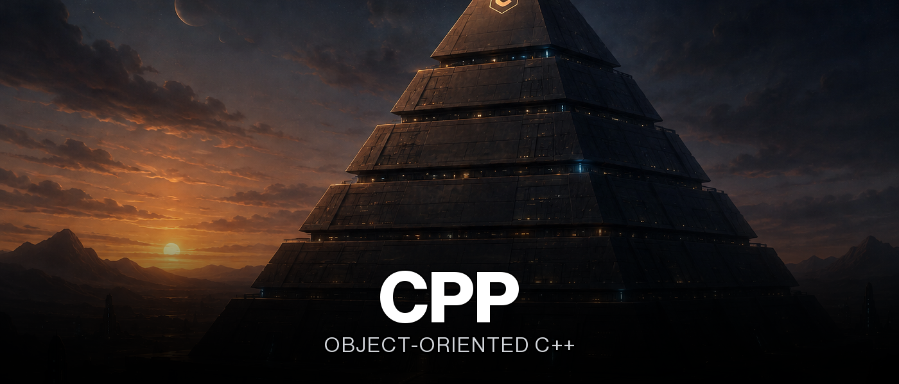

<div align="center">
  

  <p>
    <b>Ten modules moving from C to object-oriented C++: classes, inheritance, polymorphism, exceptions, templates, and the STL.</b>
  </p>

  <p>
    <a href="https://42lausanne.ch"></a>
    
    
  </p>

  <p>
    
    
    
    
    
    
    
  </p>
</div>


<a name="overview"></a>
<h2 align="center">Overview</h2>

<div align="center">

The CPP piscine takes the same rigor as the C common core (`-Wall -Wextra -Werror`,
no leaks, one class per file) and applies it to object-oriented programming: classes with
real encapsulation, inheritance chains and virtual destructors, operator overloading,
custom exceptions, and eventually the STL and its iterators. Each module (`CPP00` to
`CPP09`) isolates one or two concepts at a time, from a simple `PhoneBook` class to a
merge-insertion sort built on two different STL containers.

Every exercise compiles independently under strict `-std=c++98`, the version of the
language the subject deliberately restricts everything to until the STL modules.

</div>


<a name="highlights"></a>
<h2 align="center">Highlights</h2>

- **Every module is scoped to a small number of concepts.** `CPP00` is classes and encapsulation, `CPP03`/`CPP04` are inheritance and polymorphism, `CPP05` is exceptions, `CPP06` is casting, `CPP07`/`CPP08` are templates and the STL; nothing is introduced before its dedicated module.
- **Orthodox Canonical Form shows up everywhere it's required.** Default constructor, copy constructor, copy assignment operator, and destructor are implemented explicitly wherever the subject asks for it, rather than relying on the compiler-generated versions.
- **Inheritance is exercised through a genuinely branching hierarchy.** `CPP03`'s `DiamondTrap` combines `ScavTrap` and `FragTrap` through diamond inheritance from a common `ClapTrap` base, forcing an explicit resolution of which base class's members actually get used.
- **Abstract interfaces separate contract from implementation.** `CPP04`'s `ICharacter` and `IMateriaSource` and `CPP05`'s `AForm` define pure virtual interfaces that concrete classes (`Cure`, `Ice`, `ShrubberyCreationForm`, ...) implement independently.
- **Custom exceptions carry real, class-specific error information.** `Bureaucrat` and `AForm` each define their own nested exception classes instead of throwing generic `std::exception`.
- **Templates are built from scratch before the STL is introduced.** `CPP07`'s `Array<T>` and `iter()` function template come before `CPP08`'s containers, so generic programming is understood before it's outsourced to `std::vector`/`std::stack`/`std::list`.
- **The final module solves the same sorting problem with two different container types.** `PmergeMe` (merge-insertion sort / Ford-Johnson algorithm) is implemented once, then benchmarked using two different STL containers to compare their performance characteristics.


<a name="build--usage"></a>
<h2 align="center">Build & Usage</h2>

Each exercise has its own `Makefile`; there's no single top-level build.

```bash
cd CPP03/ex03
make        # builds the exercise binary
make clean  # removes object files
make fclean # removes object files and the binary
make re     # fclean + all
```

```bash
./diamondTrap
```


<a name="design-notes"></a>
<h2 align="center">Design Notes</h2>

The subject deliberately withholds modern C++ features until the module that's meant to
teach them, which shapes how early exercises have to be written.

> [!NOTE]
> **`-std=c++98` is enforced from the first exercise to the last.** No `auto`, no range-based `for`, no `nullptr`; every module has to solve its problem with what C++98 actually offers, which is precisely the point of the exercise.

> [!IMPORTANT]
> **Virtual destructors are required the moment a base class pointer can hold a derived object.** `ClapTrap`'s hierarchy and `CPP04`'s `Animal`/`Cat`/`Dog` both rely on `delete`ing through a base pointer, which without a virtual destructor deletes only the base part of the object.

> [!TIP]
> **`CPP02`'s `Fixed` class reimplements fixed-point arithmetic instead of using floats.** Operator overloading (`+`, `-`, `*`, `/`, comparisons) has to reproduce correct rounding and precision behavior on top of a raw integer internal representation, which is a much stricter test of operator overloading than a toy example would be.

> [!WARNING]
> **`CPP06`'s casts are not interchangeable.** `static_cast`, `dynamic_cast`, and `reinterpret_cast` each solve a different problem; using `dynamic_cast` for a plain type identification check versus a null-check on failure (`ex02`) determines whether the code path can safely handle a cast that doesn't apply.


<a name="project-structure"></a>
<h2 align="center">Project Structure</h2>

```text
CPP/
├── CPP00/  # Namespaces, classes, member functions, stdio streams
│   ├── ex00  Megaphone
│   ├── ex01  PhoneBook / Contact
│   └── ex02  Account
├── CPP01/  # Memory allocation, pointers vs. references, file streams
│   ├── ex00-ex01  Zombie (heap vs. stack, arrays of objects)
│   ├── ex02  Pointers vs. references
│   ├── ex03  Weapon (reference members)
│   ├── ex04  fileReplacer
│   └── ex05-ex06  Harl (member function pointers)
├── CPP02/  # Ad-hoc polymorphism, operator overloading
│   └── ex00-ex03  Fixed (fixed-point number class)
├── CPP03/  # Inheritance
│   └── ex00-ex03  ClapTrap / ScavTrap / FragTrap / DiamondTrap
├── CPP04/  # Subtype polymorphism, abstract classes, interfaces
│   ├── ex00-ex02  Animal / Cat / Dog / Brain
│   └── ex03  Character / AMateria / ICharacter / IMateriaSource
├── CPP05/  # Repetition and exceptions
│   ├── ex00-ex01  Bureaucrat / Form
│   └── ex02-ex03  AForm hierarchy / Intern
├── CPP06/  # Casts
│   ├── ex00  ScalarConverter
│   ├── ex01  Serializer
│   └── ex02  Type identification (Base / A / B / C)
├── CPP07/  # Templates
│   ├── ex00  Whatever (function templates)
│   ├── ex01  iter()
│   └── ex02  Array<T>
├── CPP08/  # Templated containers, the STL
│   ├── ex00  easyfind
│   ├── ex01  Span
│   └── ex02  MutantStack
└── CPP09/  # STL, algorithms
    ├── ex00  BitcoinExchange
    ├── ex01  RPN (reverse polish notation calculator)
    └── ex02  PmergeMe (Ford-Johnson merge-insertion sort)
```


<a name="module-reference"></a>
<h2 align="center">Module Reference</h2>

<table width="100%">
<tr><th width="12%">Module</th><th width="34%">Theme</th><th>Key Classes</th></tr>
<tr><td align="center"><a href="CPP00"><code>CPP00</code></a></td><td>Namespaces, classes, member functions, C++ streams</td><td><code>Megaphone</code>, <code>PhoneBook</code>, <code>Contact</code>, <code>Account</code></td></tr>
<tr><td align="center"><a href="CPP01"><code>CPP01</code></a></td><td>Memory allocation, pointers vs. references, file streams</td><td><code>Zombie</code>, <code>Weapon</code>, <code>Harl</code>, <code>fileReplacer</code></td></tr>
<tr><td align="center"><a href="CPP02"><code>CPP02</code></a></td><td>Ad-hoc polymorphism, operator overloading, orthodox canonical form</td><td><code>Fixed</code></td></tr>
<tr><td align="center"><a href="CPP03"><code>CPP03</code></a></td><td>Inheritance, including diamond inheritance</td><td><code>ClapTrap</code>, <code>ScavTrap</code>, <code>FragTrap</code>, <code>DiamondTrap</code></td></tr>
<tr><td align="center"><a href="CPP04"><code>CPP04</code></a></td><td>Subtype polymorphism, abstract classes, interfaces</td><td><code>Animal</code>, <code>Cat</code>, <code>Dog</code>, <code>ICharacter</code>, <code>AMateria</code></td></tr>
<tr><td align="center"><a href="CPP05"><code>CPP05</code></a></td><td>Repetition and exceptions</td><td><code>Bureaucrat</code>, <code>AForm</code>, <code>Intern</code></td></tr>
<tr><td align="center"><a href="CPP06"><code>CPP06</code></a></td><td>Casts: static, dynamic, reinterpret</td><td><code>ScalarConverter</code>, <code>Serializer</code></td></tr>
<tr><td align="center"><a href="CPP07"><code>CPP07</code></a></td><td>Function and class templates</td><td><code>Whatever</code>, <code>Array&lt;T&gt;</code></td></tr>
<tr><td align="center"><a href="CPP08"><code>CPP08</code></a></td><td>Templated functions over STL containers</td><td><code>Span</code>, <code>MutantStack</code></td></tr>
<tr><td align="center"><a href="CPP09"><code>CPP09</code></a></td><td>STL containers and algorithms in practice</td><td><code>BitcoinExchange</code>, <code>RPN</code>, <code>PmergeMe</code></td></tr>
</table>


<a name="skills-developed"></a>
<h2 align="center">Skills Developed</h2>

<table width="100%">
<tr><th>Learning Outcome</th><th width="28%">Piscine Skill Area</th></tr>
<tr><td>Object-oriented design: encapsulation, inheritance, polymorphism</td><td align="center">Imperative Programming</td></tr>
<tr><td>Resource management and the orthodox canonical form</td><td align="center">Rigor</td></tr>
<tr><td>Exception-based error handling</td><td align="center">Algorithms & AI</td></tr>
<tr><td>Generic programming with templates and the STL</td><td align="center">Algorithms & AI</td></tr>
</table>


<a name="result"></a>
<h2 align="center">Result</h2>

<div align="center">

<sup><i>All ten modules (CPP00 – CPP09) completed. Last module validated on May 2, 2026.</i></sup>

</div>


<div align="center">

<sub>42 Lausanne · Common Core</sub>

</div>
